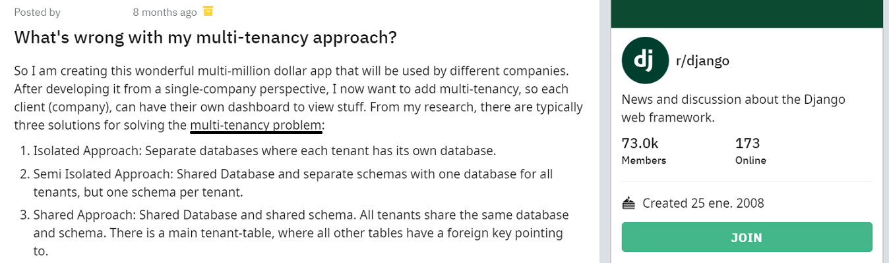

name: title
class: middle

# Yet another package for<br/>multi-tenancy in Django

Lorenzo Peña &middot; @lorinkoz

---

## The agenda

1. Django in 2020
2. Django, multi-tenancy & you
3. The challanges ahead
    - The active tenant
    - Database, models & managers
    - Routing requests to tenants
    - The scope of everything else
    - Cross-tenant security
4. Yet another package for this

---

class: middle
layout: false

# Django in 2020

---

## 2020 is going great so far


---

layout: true

## But so is Django <small>(no... seriously)</small>


---

-   Mature, solid and battle tested.
-   For perfectionists (like you)
-   For people with deadlines (like you)

---

-   Vast ecosystem - over 4k projects.ref[1]
-   Bright minds are second-guessing the modern web.ref[2]
-   People are doing email services today in vanilla monolith makers.ref[3]

.bottom[
.footnote[.ref[1] As listed in https://djangopackages.org]
.footnote[.ref[2] https://macwright.org/2020/05/10/spa-fatigue.html]
.footnote[.ref[3] https://twitter.com/dhh/status/1275901955995385856?s=20]
]

---

class: middle
layout: false

# Django, multi-tenancy & you

--

What do Django, multi-tenancy and you have in common?

---

## I have an hypothesis

--

The world is divided in two kinds of Djangonauts:

-   Those who **have done** multi-tenancy.
-   Those who **will be doing** multi-tenancy anytime soon.

--

.box[🔥 Hot take, isn't it?]

--

.right[Well...]

---

.top[

]

---

.top[

]

.box[Sooner or later, you're going to have a<br/>🤑 multi-million dollar idea]

---

.top[

]
.box[And you're going to need some form of<br/>🏘️ multi-tenancy for it]

---

.top[

]

.box[And as crazy as it may sound, in order to implement it, you're going to use 🥁 Django]

---

.top[

]

.box[So let's face it:<br/>🔥 This post may as well have been made by you]

---

class: middle
layout: false

What do Django, multi-tenancy and you have in common?

--

The future... at least 😉

---

class: center middle

## Take the .red[red] pill, Neo


---

## What is multi-tenancy

Software architecture in which a single instance of software runs on a server and serves multiple tenants.

A tenant is a group of users who share a common access with specific privileges to the software instance..ref[1]

.bottom[
.footnote[.ref[1] https://en.wikipedia.org/wiki/Multitenancy]
]

---

layout: true

## Types of multi-tenancy

---

Users exist in the context of tenants

.center[]

---

Users exist at the same level of tenants

.center[]

---

Users are equivalent to tenants (similar to single-tenancy)

.center[]

---

layout: false

## How do we get to it?

-   Many things to do, and do right.
-   Non trivial parts.
-   Help is very much appreciated.

---

## Package first?

-   There is a number of solid packages to help with the multi-tenancy problem in Django.
-   The whole idea of this talk came from my experience forking one of those packages.

.box[✋ But let's not take a package-first approach]

Instead, let's pretend we're going to implement multi-tenancy from scratch, without the help of any package.

---

class: middle
layout: false

# The challenges ahead

---

layout: true

## The active tenant

---

We have to adjust our mindset:

.box[Most operations will now require a tenant to be considered **the active tenant**]

---

There are things that are currently tracked by Django as an **active something** independent of the request / response cycle. For instance: **timezone** and **language**.

We could use the same logic to also track the **active tenant**, so that we get at our disposal:

```python
tenant = get_active_tenant()
set_active_tenant(tenant)
```

---

.warning[What if, for some operation, there is **no active tenant**?]

We will have to answer these questions in a case by case basis:

-   Does this operation have sense in a tenant agnostic way?
-   Should we interpret the lack of tenant as an indication that the operation must be performed on all tenants?
-   Is the lack of a tenant a bug in this context?

---

Every part of the framework needs to be able to operate in the scope of the active tenant:

.left-column[

-   Database access
-   URL reversing
-   Admin interface
-   Cache
    ]

.right-column[

-   Channels (websockets)
-   Management commands
-   Celery tasks
-   File storage
    ]

And everything else...

---

class: middle
layout: false

# Database, models & managers

---

layout: true

## Database architecture

---

.left-column-66[**Isolated:** Multiple databases, one per tenant]
.right-column-33[]

---

.left-column-66[**Semi-isolated:** One database, one schema per tenant (PostgreSQL)]
.right-column-33[]

---

.left-column-66[**Shared:** One database, tenant column on (almost) every table]
.right-column-33[]

---

layout: true

## Isolated databases

---

Multi-database configuration in Django settings

```python
DATABASES = {
    "default": {...},
    "tenant1": {...},
    "tenant2": {...},
    "tenant3": {...},
    ...
}
```

---

Queries need to define the active tenant.

```python
order = Order(...)
order.save(using="tenant1")

Order.objects.using("tenant2").filter(...)
Order.objects.db_manager("tenant2").do_something(...)
```

.box[🙋 How to control queries outside of your code?]

---

Django has a thing called database routers

```python
class IsolatedTenantsRouter:

    def db_for_read(self, model, **hints):
        active_tenant = get_active_tenant()
        return get_database_for_tenant(active_tenant)

    def db_for_write(self, model, **hints):
        active_tenant = get_active_tenant()
        return get_database_for_tenant(active_tenant)
```

---

**.red[Limitations]**

-   No cross-tenant relations.
-   No relation between tenants and shared data.
-   Increased costs of deployment.
-   Adding tenants require reconfiguring the project.

---

layout: true

## Shared database

---

All tenant-specific models require a FK to the model that controls the tenants:

```python
class SharedTenantModel(models.Model):

    tenant = models.ForeignKey(
        "tenant_app.TenantModel",
        on_delte=models.CASCADE,
        related_name="%(class)ss"
    )

    class Meta:
        abstract = True
```

---

Assign active tenant before creating a model instance:

```python
order = Order(...)
order.tenant = get_active_tenant()
order.save()
```

---

Use active tenant in all queries:

```python
# In regular queries
Order.objects.create(tenant=get_active_tenant(), ...)
Order.objects.filter(tenant=get_active_tenant(), ...)

# But also in related queries
some_customer.orders.filter(
    order__tenant=get_active_tenant(),
    ...
)
```

---

Set active tenant when saving a form / serializer:

```python
# Form
instance = OrderForm.save(commit=False)
instance.tenant = get_active_tenant()
instance.save()

# DRF Serializer
instance = serializer.save(tenant=get_active_tenant())
```

---

**.red[Limitations]**

-   Increased complexity of isolating the tenants.

---

layout: true

## Semi-isolated database

---

.warning[⚠️ HYPE WARNING]

Use PostgreSQL schemas.ref[1] to isolate tenants within a single database.

The concept of `search_path` allows for interesting combinations of isolated and shared data.

.bottom[
.footnote[.ref[1] https://www.postgresql.org/docs/9.1/ddl-schemas.html]
]

---

.center[]

---

layout: false

## Does it scale?

You mean, in which dimension?

-   Number of tenants
-   Development boilerplate
-   Deployment hassle

---

class: middle
layout: false

# Routing requests to tenants

---

class: middle
layout: false

# The scope of everything else

---

class: middle
layout: false

# Cross-tenant security

---

class: middle
layout: false

# Yet another package for this

---

template: title
